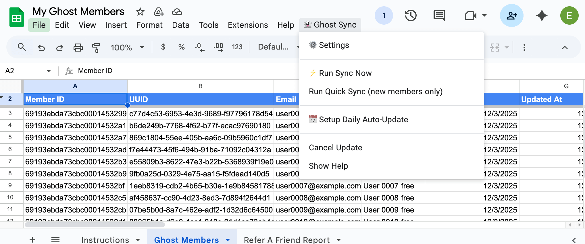

# Ghost Members Sync for Google Sheets

Sync your full Ghost CMS member data to a Google Sheet, including attribution/referrer fields and geolocation.

**Features:**
- Sync happens within your Google Sheet. No need to trust a third-party sync service.
- Can fetch attribution fields (source, UTM strings, referrer), which are not available in normal exports.
- Pulls data from the API. Doesn't rely on webhooks.
- Optional automatic daily syncing.
- Open source and free

**Note:** This script should be very safe to run since it only fetches data and does not modify anything on the Ghost side, but you should always make sure you have up-to-date and tested backups.

**Limitations:**
- Fetching attribution data (if enabled) is sloooooww (~125 members per minute with Ghost Pro as the server)
- Google has [quotas](https://developers.google.com/apps-script/guides/services/quotas) that limit how much automated code can run in a Google Sheet within one day. If you are fetching attribution data and have a large members list this may make it hard to complete the first initial sync within one day. Using a Google Workspace account instead of a regular GMail account should help.

**I created this to tool to make it easy to run a ["Refer-A-Friend" Campaign in Ghost](https://eli.pizza/posts/referral-campaign-in-ghost/). The blog post has some additional information.**

## Installation

1. **Create a Google Sheet** then on the menu: Extensions → Apps Script
2. Delete any existing code and paste in the contents of [GhostMembersSync.gs](./GhostMembersSync.gs)
3. Hit **Save**, go back to tab with the spreadsheet and **reload**. You should see a new "👻 Ghost Sync" menu in a moment.

### First Run: Authorization

Click **Ghost Sync → Settings** on the menu and authorize if prompted:
- Select your Google account
- Ignore "Google hasn't verified this app" warning - click **Advanced** → **"Go to Unnamed Project (unsafe)"**
- Grant permissions: Click "Select All" and then scroll to the bottom and click "Continue"

## Setup & Usage

Click **Ghost Sync → Settings**, enter your Ghost admin URL and API key, choose attribution data option, and save.

**Sync Options:**
- **Run Sync Now** - Complete refresh (use for first sync)
- **Run Quick Sync** - New members only (requires one full sync first)
- **Setup Daily Auto-Update** - Will run a sync nightly around midnight

## Working with Data

**Don't edit the "Ghost Members" sheet directly** - it gets overwritten during sync.

Create separate analysis sheets using formulas like:
`=QUERY('Ghost Members'!A:Z, "SELECT * WHERE E='paid'")`

## Security

Your Ghost API key provides full admin access:
- Only share with trusted collaborators
- Use "View only" when possible
- Create separate analysis sheets for untrusted users
- Revoke compromised keys in Ghost Admin → Settings → Integrations

**Safety Reminder:** While this script has been designed with safety best practices, you should always have backups of your Ghost data before using any sync tools. The script directly interacts with your Ghost CMS data through the API.

## Troubleshooting

- Stuck sync: **Ghost Sync → Cancel Update** → run new Full Update
- View logs: Extensions → Apps Script → Execution log
